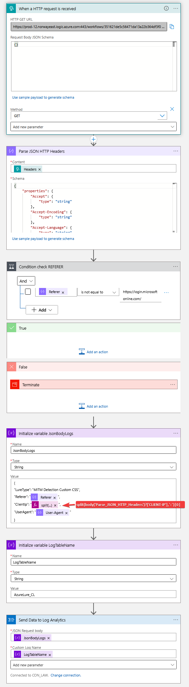

# Logic App for detecting phising sites

To get the most from this Logic App; the trigger URL should be part of your custom CSS for your Microsoft teanants custom branding.

```css
.ext-footer {
  background-size: 0 0;
  background-image: url('URL-COPIED-FROM-LOGICAPP');
}
```

This Logic App takes a HTTP GET requests, looks at the referer and checks if it is Microsoft, or a phising site.

If it is not a Microsoft referer, it gets sendt to the table AzureLure_CL in Log Analytics for Microsoft Sentinel to handle. 

## Configure Logic App

Deploy your Logic App and in the *Logic App Code View* paste the content of `mitm-detection-logicapp-code.json`. The last action is a placeholder since dealing with Connections is a pain.

## Paste JSON HTTP Header Schema

```json
{
    "properties": {
        "Accept": {
            "type": "string"
        },
        "Accept-Encoding": {
            "type": "string"
        },
        "Accept-Language": {
            "type": "string"
        },
        "CLIENT-IP": {
            "type": "string"
        },
        "Content-Length": {
            "type": "string"
        },
        "DISGUISED-HOST": {
            "type": "string"
        },
        "DNT": {
            "type": "string"
        },
        "Host": {
            "type": "string"
        },
        "Max-Forwards": {
            "type": "string"
        },
        "Referer": {
            "type": "string"
        },
        "Sec-Fetch-Dest": {
            "type": "string"
        },
        "Sec-Fetch-Mode": {
            "type": "string"
        },
        "Sec-Fetch-Site": {
            "type": "string"
        },
        "Sec-GPC": {
            "type": "string"
        },
        "User-Agent": {
            "type": "string"
        },
        "WAS-DEFAULT-HOSTNAME": {
            "type": "string"
        },
        "X-ARR-LOG-ID": {
            "type": "string"
        },
        "X-ARR-SSL": {
            "type": "string"
        },
        "X-AppService-Proto": {
            "type": "string"
        },
        "X-Forwarded-For": {
            "type": "string"
        },
        "X-Forwarded-Proto": {
            "type": "string"
        },
        "X-Forwarded-TlsVersion": {
            "type": "string"
        },
        "X-Original-URL": {
            "type": "string"
        },
        "X-SITE-DEPLOYMENT-ID": {
            "type": "string"
        },
        "X-WAWS-Unencoded-URL": {
            "type": "string"
        }
    },
    "type": "object"
}
```

## Logic App Visualisation

